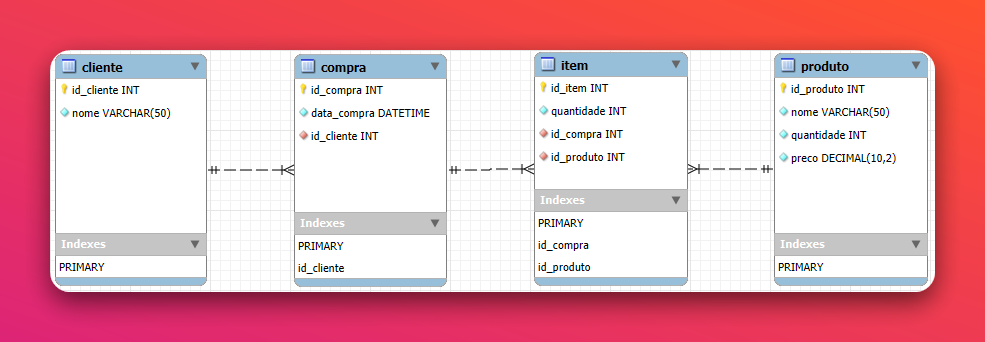

# caixaMercado


Sistema de vendas para ponto de venda (PDV) com interface gráfica moderna em Flet (Flutter) e modo terminal, persistência em MySQL e arquitetura hexagonal. Desenvolvido com foco em coesão, encapsulamento e testabilidade.

---

## Bad Smells Identificados e Corrigidos

| Localização | Smell | Técnica aplicada | Princípio |
|---|---|---|---|
| `atendimento_service.py` | Carrinho como `list[dict]` sem contrato | Replace Dict with Dataclass → `ItemCarrinho` | SRP, Fail-Fast |
| `atendimento_service.py` | Função com 69 linhas e múltiplas responsabilidades | Extract Function | SRP, KISS |
| `produto_service.py` | `getattr(p, 'id', p.get('id'))` — dualidade de tipo | Unificar acesso; remover suporte implícito a dict | DRY, KISS |
| `cliente_service.py` | Import lazy dentro de função sem dependência circular | Move import para nível de módulo | Clean Code |
| `caixa_service.py` | `menu_caixa()` e `entrar_opcao_caixa()` sem callers | Inline Function | YAGNI |
| `sistema_service.py` | Inicialização mistura conexão, criação de schema e seed | Extract Function por responsabilidade | SRP |
| `cliente_controller.py` | `input()` e `print()` embutidos no controller | Extract — mover toda I/O para `cliente_view.py` | SRP, separação de camadas |
| `atendimento_service.py` | `input()` e `print()` embutidos no service | Extract — mover toda I/O para `atendimento_view.py` | SRP, separação de camadas |
| `sistema_view.py` | View acessando DB diretamente via `carregar_dados_msg()` | Move Function — view recebe dados prontos como parâmetro | Separação de camadas |
| `produto_view.py` | View importando e chamando controller diretamente | Remove import; view recebe listas por parâmetro | Separação de camadas |
| `caixa_service.py` | `sessao.close()` dentro do service | Move — ciclo de vida da sessão gerenciado apenas por `sistema_service` | SRP |
| `conexao_db.py` | `print()` comentados residuais | Remoção de dead code | Clean Code, Anti-Boilerplate |
| `controller/*.py` | DB queries (`sessao.query`) espalhados por toda camada | Repository Pattern — isolar acesso a dados em `infrastructure/repositories/` | Clean Architecture |
| `sistema_controller.py` | `if opcao == 1 / elif opcao == 2` inline | Command Pattern — cada opção é um `Comando` executável | OCP |
| `util.validar_nome()` | Regras de validação embutidas em função procedural | Strategy Pattern — `ValidadorNome` com `RegraValidacao` compostas | SRP, OCP |
| `atendimento_use_case.py`, `cliente_use_case.py`, `caixa_use_case.py` | Use cases importando views diretamente — violação de DIP | Ports & Adapters — ABCs em `core/ports.py`, adaptadores de terminal em `views/`, adaptadores Flet em `flet/adapters/` | SRP, DIP |

---

## Métricas Antes/Depois

| Indicador | Antes | Depois |
|---|---|---|
| Maior função (linhas) | 69 | 40 |
| Objetos de domínio tipados | 0 (dicts crus) | `ItemCarrinho` com validação |
| Imports lazy sem razão técnica | 2 | 0 |
| Funções wrapper sem valor | 2 | 0 |
| `input()` fora da camada view | 4+ ocorrências | 0 |
| `print()` fora da camada view | 5+ ocorrências em services | 0 |
| Views com acesso direto a DB | 1 (`sistema_view`) | 0 |
| Views com import de controller | 1 (`produto_view`) | 0 |
| Gerenciamento de sessão em services | 1 (`caixa_service`) | 0 |
| Testes automatizados | 0 | 9 (6 unit + 3 property) |
| Interfaces de I/O intercambiáveis | 0 | 2 (terminal + Flet) via Ports & Adapters |

---

## Arquitetura

```
caixaMercado/
├── app/
│   ├── core/
│   │   ├── ports.py                 # Ports & Adapters: ABCs AtendimentoPort, ClientePort, CaixaPort
│   │   ├── atendimento_use_case.py  # orquestra fluxo de compra — sem acoplamento à I/O
│   │   ├── cliente_use_case.py      # identifica e cadastra cliente — sem acoplamento à I/O
│   │   ├── caixa_use_case.py        # fechamento do caixa — sem acoplamento à I/O
│   │   ├── comando.py               # ABC Comando (Command Pattern)
│   │   ├── atendimento_handler.py   # Command: instancia repositórios + adapters, dispara use case
│   │   └── fechar_caixa_handler.py  # Command: instancia repositórios + adapter caixa
│   ├── domain/
│   │   ├── models.py                # entidades SQLAlchemy + ItemCarrinho (dataclass de domínio)
│   │   ├── repositories/            # interfaces abstratas (ABC) — zero dependência de ORM
│   │   │   ├── cliente_repository.py
│   │   │   ├── compra_repository.py
│   │   │   ├── operador_repository.py
│   │   │   └── produto_repository.py
│   │   └── validators/              # Strategy: ValidadorNome compõe RegraValidacao
│   │       └── nome_validator.py
│   ├── flet/                        # camada Flet — interface gráfica Flutter/Material Design 3
│   │   ├── app.py                   # main(page): window, tema, header, navegação
│   │   ├── bridge.py                # InputBridge — threading.Event para sincronizar use cases
│   │   ├── theme.py                 # paleta dark/light, sombras macOS, animações
│   │   ├── controller.py            # PageController — mutações de UI centralizadas
│   │   ├── operators.py             # helpers de operadores (cor, iniciais)
│   │   ├── adapters/
│   │   │   ├── atendimento_adapter.py  # AtendimentoFletAdapter(AtendimentoPort)
│   │   │   ├── cliente_adapter.py      # ClienteFletAdapter(ClientePort)
│   │   │   └── caixa_adapter.py        # CaixaFletAdapter(CaixaPort)
│   │   └── pages/
│   │       ├── splash.py            # tela de carregamento com inicialização do banco em thread
│   │       ├── login.py             # autenticação de operador
│   │       ├── dashboard.py         # visão geral com KPIs e gráficos
│   │       ├── estoque.py           # listagem e status de estoque por produto
│   │       ├── relatorios.py        # relatórios de vendas, calendário e top produtos
│   │       └── cadastros.py         # CRUD de produtos, clientes e operadores
│   ├── infrastructure/
│   │   ├── sistema_service.py       # inicialização, seed e ciclo de vida da sessão
│   │   └── repositories/            # implementações SQLAlchemy das interfaces de domínio
│   │       ├── cliente_repository.py
│   │       ├── compra_repository.py
│   │       ├── operador_repository.py
│   │       └── produto_repository.py
│   ├── shared/                      # utilitários puros reutilizáveis
│   ├── assets/                      # estilos ANSI e logomarca (modo terminal)
│   └── views/                       # I/O de terminal + adapters de terminal para as ports
│       ├── atendimento_adapter.py   # AtendimentoTerminalAdapter(AtendimentoPort)
│       ├── cliente_adapter.py       # ClienteTerminalAdapter(ClientePort)
│       ├── caixa_adapter.py         # CaixaTerminalAdapter(CaixaPort)
│       └── sistema_view.py          # menu principal do terminal
├── assets/                          # SVG logos usados pelo Flet
├── database/
│   ├── connection/      # ConexaoDB e variáveis de ambiente
│   └── data/            # scripts SQL e seed CSV
├── docker/
│   ├── Dockerfile               # multi-stage: base → app (CLI) → flet → test → playwright
│   └── docker-compose.yml       # compose unificado: db + flet + app + test + playwright + adminer
├── .env.example         # template de variáveis para Docker Compose
├── k8s/                 # manifestos Kubernetes (MySQL + Flet deployment)
├── docs/                # DER e relatório técnico
├── tests/
│   ├── unit/            # testes determinísticos
│   ├── property/        # property-based tests (hypothesis)
│   ├── playwright_test.py  # testes E2E Playwright
│   └── test_visual.py      # testes visuais (snapshots)
├── main.py              # entry point — CLI (--cli) ou Flet web (padrão) ou desktop (--desktop)
├── requirements.txt
├── run.bat
└── run.sh
```

### Diagrama Entidade-Relacionamento



---

## Decisões Técnicas

**`ItemCarrinho` como dataclass de domínio**
O carrinho era representado por `list[dict]` sem nenhum contrato. Dicionários não oferecem validação, autodocumentação nem encapsulamento. A dataclass `ItemCarrinho` define o tipo com `__post_init__` para validação Fail-Fast e `subtotal` como `@property`, tornando o cálculo responsabilidade do objeto — não do serviço que o usa.

**Separação de funções em `atendimento_service.py`**
Uma função de 69 linhas com múltiplas responsabilidades viola SRP e dificulta testes isolados. A extração de `_produto_disponivel`, `_quantidade_valida`, `_confirmar_adicao`, `_confirmar_compra` e `_processar_item` reduz cada bloco a uma intenção única, tornando o loop principal legível como sequência de passos.

**Remoção de wrappers sem valor em `caixa_service.py`**
`menu_caixa()` e `entrar_opcao_caixa()` delegavam sem adicionar nenhuma lógica e não eram chamados por nenhum módulo. Funções assim aumentam a superfície de API sem motivo técnico — removê-las segue YAGNI.

**Import em nível de módulo em `cliente_service.py`**
Import lazy dentro de função oculta dependências e penaliza a primeira chamada. A análise confirmou ausência de dependência circular — o import foi movido para o topo do módulo, como convenciona PEP 8.

**Repository Pattern: domínio sem dependência de infraestrutura**
As interfaces abstratas em `domain/repositories/` definem contratos de acesso a dados sem mencionar SQLAlchemy ou sessão. As implementações concretas em `infrastructure/repositories/` encapsulam toda query. Os casos de uso recebem repositórios por injeção de dependência e são completamente testáveis sem banco.

**Command Pattern: menu como mapa de objetos executáveis**
Cada opção do menu é um `Comando` com método `executar()`. O loop em `sistema_controller.py` despacha via `comandos[opcao].executar()` — sem `if/elif`. Adicionar uma nova opção é criar um novo `Comando` e registrá-lo no dict, sem tocar no loop.

**Strategy Pattern: validação de nome como composição de regras**
`ValidadorNome` aplica uma lista de `RegraValidacao`. Cada regra é independente: `RegraVazio` verifica preenchimento, `RegraFormatoNome` verifica o padrão léxico. Adicionar ou remover uma regra não altera as demais nem a interface do validador.

**Ports & Adapters (Arquitetura Hexagonal): use cases sem acoplamento à I/O**
Os use cases importavam diretamente funções de `views/` — violação de DIP. A solução define três ABCs (`AtendimentoPort`, `ClientePort`, `CaixaPort`) em `core/ports.py`. Os use cases recebem a porta por injeção no construtor. Há duas implementações concretas: `views/*_adapter.py` (terminal) e `flet/adapters/*_adapter.py` (Flet). Trocar a interface de terminal para GUI não exige alterar nenhuma linha de domínio ou use case.

**Interface gráfica Flet com bridge de threading**
Flet é event-driven; os use cases são síncronos e bloqueantes. O `InputBridge` (`threading.Event`) resolve o impedance mismatch: o use case roda em thread daemon e bloqueia em `bridge.wait()` até o usuário interagir com a UI, que resolve com `bridge.resolve(value)`. O loop Flet na thread principal permanece sempre responsivo.

**Separação estrita de camadas: view, service, controller**
Toda I/O de terminal (`input()`, `print()`) reside exclusivamente nas views. Services não conhecem o terminal; controllers não conhecem o banco. `cliente_view.py` foi extraída do controller; `atendimento_view.py` foi expandida para absorver toda I/O que estava embutida no service. Views recebem dados prontos por parâmetro — nunca buscam diretamente.

**Ciclo de vida da sessão gerenciado em ponto único**
`sessao.close()` é responsabilidade exclusiva de `sistema_service.finalizar_sistema()`, no bloco `finally`. Services aninhados como `caixa_service.fechar_caixa()` não fecham nem comprometem a sessão — apenas operam dentro dela. Isso elimina o risco de sessão fechada prematuramente e torna o fluxo de recurso rastreável.

**Docker Compose unificado com redes segregadas e profiles**
Dois arquivos compose independentes foram consolidados em um único `docker-compose.yml` na raiz. Serviços públicos (`flet`, `adminer`) integram a rede `frontend`; serviços internos (`db`, `app`, `test`) ficam exclusivamente na rede `backend`. Cada serviço opcional usa `profiles` para ativação sob demanda — `flet` e `db` sobem sem profile; `app` (CLI interativo) requer `--profile cli`; `test` requer `--profile test`; `adminer` requer `--profile dev`. A CLI usa `input()` em múltiplos pontos, o que torna K8s inadequado para o processo principal — a divisão adotada mantém Kubernetes apenas para o StatefulSet MySQL em produção.

---

## Stack

| Tecnologia | Versão |
|---|---|
| Python | 3.13 (Docker) |
| SQLAlchemy | 2.0.48 |
| PyMySQL | 1.1.2 |
| python-dotenv | 1.2.1 |
| tabulate | 0.10.0 |
| tqdm | 4.67.3 |
| Flet | latest |
| pytest | 9.0.2 |
| pytest-cov | 7.0.1 |
| hypothesis | 6.151.9 |
| Playwright | 1.49.0 |
| MySQL | 8.4.8 LTS |
| Docker | 27.x+ |

---

## Infraestrutura Docker

```
                    ┌──────────────────────┐
                    │  rede: web_net       │
                    │  (acesso externo)    │
                    └──────────┬───────────┘
                               │
              ┌────────────────┴────────────────┐
              │  flet — porta 8550              │
              │  adminer — porta 8081 [dev]     │
              └────────────────┬────────────────┘
                               │
                    ┌──────────┴───────────┐
                    │  rede: db_net        │
                    │  (isolada, interna)  │
                    └──────────┬───────────┘
                               │
        ┌──────────────────────┼──────────────────────┐
        │                      │                      │
   db — MySQL 8.4.8     app — CLI [cli]      test — pytest [test]
```

| Profile | Serviços ativos | Comando |
|---|---|---|
| *(nenhum)* | `db` + `flet` | `docker compose -f docker/docker-compose.yml --env-file .env up --build` |
| `cli` | + `app` (terminal interativo) | `docker compose -f docker/docker-compose.yml --env-file .env --profile cli run --rm app` |
| `test` | + `test` (pytest + cobertura) | `docker compose -f docker/docker-compose.yml --env-file .env --profile test run --rm test` |
| `e2e` | + `pw` (Playwright E2E) | `docker compose -f docker/docker-compose.yml --env-file .env --profile e2e run --rm pw` |
| `dev` | + `adminer` | `docker compose -f docker/docker-compose.yml --env-file .env --profile dev up` |

---

## Execução

```bash
# Windows
run.bat

# Linux / macOS
chmod +x run.sh && ./run.sh
```

### Primeira execução (Docker)

```bash
# 1. Copia o template de variáveis
cp .env.example .env

# 2. Sobe banco + interface Flet
docker compose -f docker/docker-compose.yml --env-file .env up --build

# 3. Acessa no browser
# http://localhost:8550
```

### CLI Terminal (Docker)

```bash
docker compose -f docker/docker-compose.yml --env-file .env --profile cli run --rm app
```

### Testes

```bash
# Unitários + property-based (pytest + hypothesis) via Docker
docker compose -f docker/docker-compose.yml --env-file .env --profile test run --rm test

# E2E com Playwright via Docker (requer flet rodando)
docker compose -f docker/docker-compose.yml --env-file .env up -d flet
docker compose -f docker/docker-compose.yml --env-file .env --profile e2e run --rm pw

# Local com cobertura HTML
pytest --cov=app --cov-report=html tests/
```

### Inspecionar banco (opcional)

```bash
docker compose -f docker/docker-compose.yml --env-file .env --profile dev up adminer
# http://localhost:8081  (Server: db | User: mercado_user)
```

---

## Configuração

Para Docker Compose, copie `.env.example` para `.env` na raiz:

```properties
DB_ROOT_PASSWORD=root_secret
DB_USER=mercado_user
DB_PASSWORD=mercado_pass
DB_NAME=mercado_at
```

Para execução local (sem Docker), copie `database/connection/.env.example` para `database/connection/.env` e ajuste `DB_HOST=localhost` com suas credenciais.

O banco é inicializado automaticamente pelo `docker-entrypoint-initdb.d` na primeira subida do container. Para recriar manualmente em ambiente local:

```bash
python database/data/executar_script_db.py
python database/data/inserir_dados_csv_no_db.py
```

---

## Testes

```bash
pytest tests/ -v                              # executa todos os testes
pytest --cov=app --cov-report=html tests/    # cobertura em htmlcov/index.html
```

Cobertura inclui:
- `test_subtotal_item_multiplica_quantidade_por_preco`
- `test_total_carrinho_soma_subtotais_de_multiplos_itens`
- `test_quantidade_zero_levanta_value_error`
- `test_quantidade_negativa_levanta_value_error`
- `test_preco_negativo_levanta_value_error`
- `test_carrinho_vazio_retorna_total_zero`
- Propriedades hypothesis: subtotal não-negativo, total == Σ subtotais, nome curto inválido

---

## Referências

- MARTIN, Robert C. *Clean Code: A Handbook of Agile Software Craftsmanship*. 2. ed. Prentice Hall, 2008.
- FOWLER, Martin. *Refactoring: Improving the Design of Existing Code*. Addison-Wesley, 1999.
- Python Software Foundation. *Python 3.14 Documentation*. 2026.
- SQLAlchemy. *SQLAlchemy 2.0 Documentation*. 2026.
- pytest. *pytest 9.x Documentation*. 2026.
- Hypothesis. *Hypothesis 6.x Documentation*. 2026.

---

<div align="center">

**André Luis Becker**
Engenharia de Software — 2026

</div>
